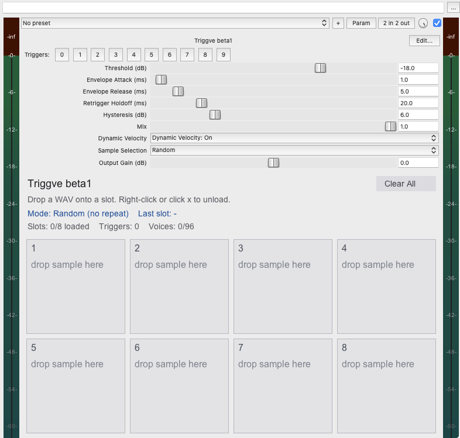

# Triggve

<p align="center">
  
</p>

A lightweight, low-latency REAPER JSFX drum replacement and sample triggering plugin for Linux and cross-platform REAPER environments. Current version: **beta3**.

`Triggve` turns drum hits into samples, triggered by either **audio transients** (an envelope detector with threshold, attack/release, hysteresis, and holdoff) or **MIDI note-ons** (parsed per block, fired at the event's exact sample offset). MIDI velocity picks one of four fixed **velocity zones** — **Low** (1–40), **Medium** (41–89), **Hard** (90–126), **Rimshot** (127); audio uses a single 8-slot bank and fires immediately at the threshold crossing. Each zone/bank holds up to 8 samples, picked with **Single**, **Round-robin**, or **Random (no immediate repeat)** selection. By default the dry input is muted (**Mix** = 1), so the plugin acts as a full drum replacement.

## Features

- **Two Trigger Sources**: **Audio** transient detection (envelope follower with configurable attack/release, threshold, hysteresis, and retrigger holdoff) or **MIDI** note-ons (**Trigger Source** menu, default MIDI).
- **MIDI Velocity Zones**: four fixed zones — **Low** (vel 1–40), **Medium** (41–89), **Hard** (90–126), **Rimshot** (127) — each a bank of up to **8 slots**. Zone selection is exact by definition; empty zones fall back to the nearest loaded one so a hit is never dropped.
- **Sample Pool**: up to 32 slots arranged zone-per-row in MIDI mode; Audio mode shows a single 8-slot **Hits** bank. Drag & drop WAV files onto slots; per-slot loaded indicator and length / channels / rate readout.
- **Easy Unloading**: Right-click a slot, click its `x`, or press **Clear All** (clears all 32 slots, including zones hidden in Audio mode).
- **Project Persistence**: Loaded file paths are stored with the project via `@serialize` and re-opened on reload.
- **Selection Modes** (per zone/bank):
  - **Single** — always the first loaded slot in the zone/bank.
  - **Round-robin** — cycles through loaded slots in order, wrapping and skipping empties.
  - **Random** — uniform pick among loaded slots, never the same as the previous hit.
- **Polyphonic Playback**: 96 independent voices so sample tails ring out naturally without hard clipping or voice stealing.
- **Dynamic Velocity Scaling** (on by default): scales the voice gain with hit strength — the hit's input peak in Audio mode (refined over ~25 ms after the trigger), or `velocity / 127` in MIDI mode. Set it **Off** to let your zone samples carry the loudness at original volume; zone/bank selection itself is always active.
- **MIDI Passthrough + Channel Filter**: choose which channel's notes trigger (**All** or 1–16); passthrough (on by default) keeps the notes flowing downstream — turn it Off to let Triggve swallow the notes it consumes.
- **Makeup Output Gain**: A ±24 dB output gain to match quiet sources, protected by the soft-clip ceiling.
- **Wet/Dry Mix**: A linear blend between the dry input and triggered samples (0 = original only, 1 = samples only), so you can dial in exactly how much of the source to keep.
- **Output Safety & Anti-Click**: A soft-clip ceiling guarantees the output never exceeds 0 dBFS, and a short transport-stop fade prevents pops when stopping mid-sample.
- **Compact Custom UI**: All controls are drawn inside the plugin window, two per row, instead of REAPER's full-width slider strip. They stay fully automatable and are saved with the project.

<p align="center">
  
</p>

## Controls

All twelve controls are drawn in the plugin's own window, two per row (the dropdowns sit at the bottom). They are hidden REAPER parameters, so they remain automatable and are stored with the project. Drag a control to set it, or hover it and use the mouse wheel (hold **Shift** for coarser steps).

| # | Control | Default | Range | One-line summary |
|---|---------|---------|-------|------------------|
| 1 | Threshold (dB) | −18 | −60 … 0 | How loud a hit must be to trigger (Audio source only). |
| 2 | Envelope Attack (ms) | 0.3 | 0.1 … 50 | How quickly the detector reacts to a rising hit. |
| 3 | Envelope Release (ms) | 5 | 1 … 45 | How quickly the detector lets go after a hit (also sets re-arm speed). |
| 4 | Retrigger Holdoff (ms) | 20 | 1 … 100 | Minimum time between two triggers. |
| 5 | Hysteresis (dB) | 6 | 0 … 24 | How far the signal must drop before the detector can fire again. |
| 6 | Mix | 1.0 | 0 … 1 | Blend of dry input vs. triggered samples. |
| 7 | Dynamic Velocity | On | Off / On | Gain follows hit strength (audio peak / MIDI velocity). Off = samples play at their original volume. |
| 8 | Sample Selection | Random | Single / Round-robin / Random | Which loaded slot plays next within the chosen zone/bank. |
| 9 | Output Gain (dB) | 0 | −24 … +24 | Makeup gain for the triggered samples. |
| 13 | Trigger Source | MIDI | Audio / MIDI | What fires the samples: the audio detector or incoming MIDI note-ons. |
| 14 | MIDI Channel | All | All / 1–16 | Which MIDI channel's notes trigger (everything else just passes through). |
| 15 | MIDI Passthrough | On | Off / On | On: notes continue downstream. Off: notes Triggve consumes are swallowed. |

> Slider slots **10–12** are intentionally unused. beta2 used them for velocity-layer boundaries; keeping those numbers unallocated means values saved by beta2 projects can never shift into the new MIDI controls.

### How the detector works (Audio source)
The plugin follows the input with an **envelope**: it rises quickly (Attack) when a hit arrives and falls slowly (Release) when it ends. A trigger fires **immediately** when the envelope crosses the **Threshold**. After firing, the detector is "disarmed" and only re-arms once the envelope falls below *Threshold minus Hysteresis*; the **Holdoff** also enforces a minimum gap between triggers. Release and Hysteresis together control how fast the next hit can be detected. Audio hits play from the single 8-slot **Hits** bank (slots 1–8); the MIDI zones stay hidden.

### How MIDI triggering works (MIDI source)
MIDI is drained once per block in `@block` and queued; each note-on is fired inside `@sample` at its **exact sample offset**, so timing is sample-accurate regardless of the audio block size. Note-ons with velocity 0 are note-offs and are ignored. The note's **velocity picks the zone** — this is exact, unlike audio peak classification:

- **Low** — velocity 1–40.
- **Medium** — velocity 41–89.
- **Hard** — velocity 90–126.
- **Rimshot** — velocity 127 (a dedicated top-velocity articulation).

A sample is then chosen **within that zone** using the Sample Selection mode; an empty zone falls back to the nearest loaded one. **Dynamic Velocity** decides whether gain also follows velocity (`vel / 127`) or every voice plays at full level — zone selection itself always applies. The channel filter (**MIDI Channel**) picks which channel triggers; with **MIDI Passthrough** On (default) the notes keep flowing downstream, e.g. to a soft synth later in the chain.

### What each slider does

**1. Threshold (dB)** — detection sensitivity.
The level the envelope must reach to fire. **Lower** = more sensitive (quiet/ghost notes trigger), **higher** = only strong hits trigger. Range −60 … 0 dB. Tune it so real hits fire but bleed/tails don't.

**2. Envelope Attack (ms)** — how fast the detector *reacts* to a rise.
**Lower** = snappier tracking of sharp transients; **higher** = smoother, ignoring very short clicks/noise. This shapes *detection only* — it does not change the played sample. Default **0.3 ms**: it is deliberately low because a slow attack delays the trigger, and that delay shows up as phasing against the dry input when you blend with **Mix**. Raise it if bleed or clicks cause false triggers.

**3. Envelope Release (ms)** — how fast the detector *lets go* after a hit.
This is the main control over **retrigger speed**: a shorter release drops below the re-arm point faster, allowing rapid successive hits. **Too short** and a long/ringy hit may re-fire. Default 5 ms.

**4. Retrigger Holdoff (ms)** — a hard minimum gap between triggers.
After a trigger, the plugin ignores further triggers for this long. It prevents double-triggers/machine-gunning independently of Release. Lower it for very fast rolls; raise it if a single hit fires twice. Default 20 ms.

**5. Hysteresis (dB)** — the re-arm margin.
After a hit, the envelope must fall *this far below* the Threshold before the detector re-arms. **Larger** = more robust against re-firing on decay/noise; **smaller** = more sensitive to closely spaced hits. Default 6 dB.

**6. Mix** — dry/wet blend.
`0` = original drum only, `1` = triggered sample only (full replacement), in between mixes both linearly. Default `1`. Use it to keep some of the source or to audition the samples.

**7. Dynamic Velocity** — optional gain scaling by hit strength.
**On** plays each voice scaled by the trigger's strength — the hit's input peak for Audio (refined by a ~25 ms peak tracker after the voice starts), `velocity / 127` for MIDI. **Off** plays every voice at its original volume. Default **On**. If your zone/bank samples already carry the loudness you want (e.g. dedicated soft and hard samples), set it to **Off** to avoid double scaling — the zone/bank choice is unaffected either way.

**8. Sample Selection** — which loaded slot plays next, within the zone (MIDI) or bank (Audio) that was chosen for the hit.
- **Single** — always the first loaded slot in the zone/bank.
- **Round-robin** — cycles through that zone/bank's loaded slots in order (skips empty slots, wraps at the end).
- **Random** — picks a loaded slot in that zone/bank at random, **never the same as the previous hit** (avoids machine-gun repetition).
If the zone/bank has only one loaded slot, every mode plays that slot. Default **Random**.

**9. Output Gain (dB)** — makeup gain for the samples.
Applied to the triggered samples (not the dry input) before the safety ceiling. Use it to match the source loudness if your samples are quieter. Range ±24 dB. The soft-clip prevents the output from exceeding 0 dBFS even when boosted. Default 0 dB.

**13. Trigger Source** — what fires the samples.
**Audio** runs the envelope detector below and plays the single 8-slot bank (the zone rows are hidden). **MIDI** ignores the detector entirely and plays on incoming note-ons, picking the zone by velocity. Default **MIDI**.

**14. MIDI Channel** — which channel's notes count.
**All** (default) reacts to note-ons on any channel; `1–16` restricts triggering to that channel. Notes on other channels are never consumed and always pass through.

**15. MIDI Passthrough** — whether the notes keep going.
**On** (default) forwards every MIDI event downstream, e.g. to a soft synth further along the FX chain. **Off** swallows the note-on/note-off messages on the selected channel (the ones Triggve itself consumes) and still forwards everything else — CC, pitch bend, program change, and notes on other channels.

### Signal flow
```
                 ┌ Audio: detector (Attack/Release/Threshold/Hysteresis/Holdoff) ─► immediate hit ─► Hits bank (slots 1-8)
trigger source ──┤
                 └ MIDI:   note-ons queued in @block ─► fired at exact offset ─► zone by velocity (Low/Med/Hard/Rim)
                                                                                              │
                                                                                              ▼
                     slot selection within zone/bank (Single/Round-robin/Random) ─► voice ─► × gain (Dynamic Velocity)
                                                                                              │
                                       × Output Gain ─► soft-clip ceiling ◄───────────────────┘
input (dry) ────────────────────────────────────────────────────────────────────────► Mix ◄──┤
                                                                                              ▼
                                                                                           output
```


## Installation

1. Open REAPER.
2. Navigate to **Options** > **Show REAPER resource path in explorer/finder**.
3. Copy `Triggve.jsfx` into your `Effects/` directory (or a custom subfolder like `Effects/DrumTools/`).
4. In REAPER's FX browser, press `F5` to rescan, then search for **Triggve**.

## Usage

1. Insert `Triggve` on the track carrying the drum audio.
2. Open the plugin's **floating FX window** (not the TCP-embedded view) so drag & drop works.
3. Choose the **Trigger Source**:
   - **MIDI** (default): feed MIDI into that track like into any other FX — a MIDI item on the same track, a live MIDI input monitored on the track, or routed from another track (its routing dialog → *MIDI output → this track*). Note-ons then pick zones by velocity: **1–40 Low, 41–89 Medium, 90–126 Hard, 127 Rimshot**. Use **MIDI Channel** to restrict which channel triggers. With **MIDI Passthrough** On (default) the notes continue downstream too — e.g. Triggve and a soft synth can share the same MIDI. Drag up to 8 WAVs into each zone row.
   - **Audio**: drag WAVs into the single **Hits** bank and adjust **Threshold** so hits fire reliably without false triggers; Attack/Release/Holdoff/Hysteresis shape the retrigger behaviour (see "How the detector works"). The left-hand row highlight and the **Last** readout show what fired.
4. Pick a **Sample Selection** mode (it applies within each zone/bank).
5. Set **Mix** to `1` for full replacement, or lower it to blend the dry drum back in.

Notes:
- Samples are resampled to the project sample rate on load and capped at **4 seconds** each.
- Loading happens only in `@gfx` / `@slider` / `@serialize` — never in `@sample` — keeping the audio thread safe.
- MIDI is received on the track Triggve sits on; multi-port/"all bus" MIDI and per-slot note learn are not supported yet.
- After editing the JSFX on disk, reload the FX (`F5` or reopen) to pick up changes.

## Roadmap

Triggve is now in **beta**. Versions progress **beta1 → beta2 → … → 1.0**. Pre-beta development history (v0.1–v0.5) is recorded in [CHANGELOG.md](CHANGELOG.md).

- [x] **beta1** — First beta: transient detector, 8-slot drag & drop pool, 96-voice playback, Single/Round-robin/Random selection, peak-accurate velocity, Output Gain, wet/dry Mix, soft-clip safety ceiling, click-free transport stop.
- [x] **beta2** — **Velocity layers**: Ghost / Low / Medium / Hard, up to 8 slots each (32 total), dB-boundary classification from the hit peak, per-layer Single/Round-robin/Random selection, layer-per-row GUI.
- [ ] **beta3** — **MIDI triggering**: Trigger Source (Audio / MIDI), fixed MIDI velocity zones (Low / Medium / Hard / Rimshot) as the slot grid, channel filter and passthrough toggle, sample-accurate note firing; audio path simplified to one 8-slot bank with immediate, latency-free triggering.
- [ ] **1.0** — Stable release. Candidates for the betas ahead: **Both** audio+MIDI mode, per-slot MIDI learn / note→slot mapping (multi-kit), per-slot enable + weighting within a zone, onset/derivative detection, click-free voice-steal / unload edge handling.

## License

Released under the [MIT License](LICENSE).
