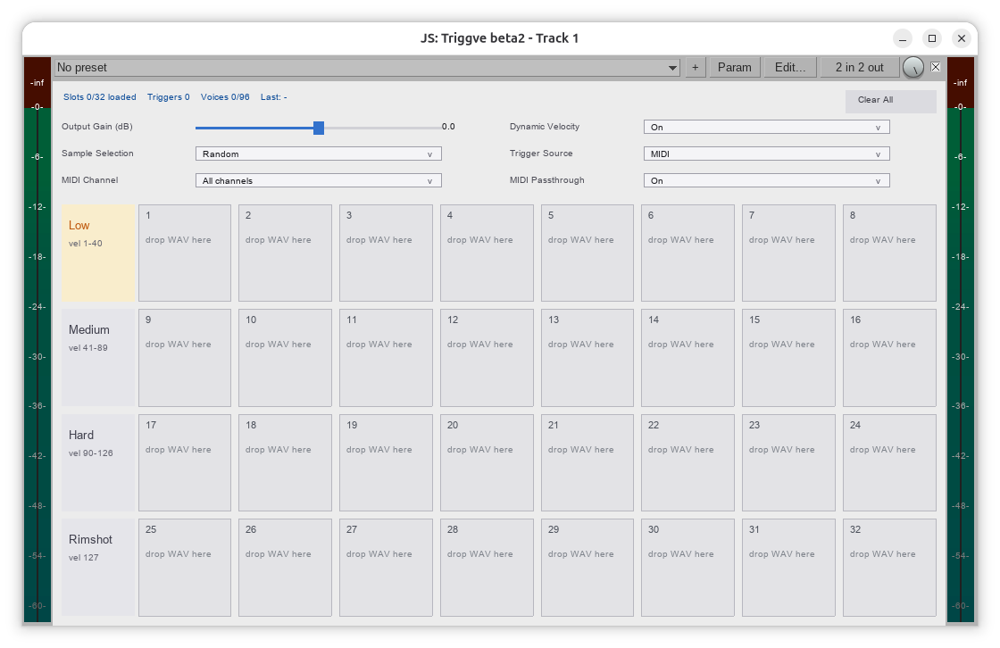

<p align="center">
  
</p>

A lightweight, 100% vibecoded low-latency REAPER JSFX drum replacement and sample triggering plugin for Linux and cross-platform REAPER environments. Current version: **1.0**.

`Triggve` turns drum hits into samples, triggered by either **audio transients** (an envelope detector with threshold, attack/release, hysteresis, and holdoff) or **MIDI note-ons** (parsed per block, fired at the event's exact sample offset). MIDI velocity picks one of four fixed **velocity zones** — **Low** (1–40), **Medium** (41–89), **Hard** (90–126), **Rimshot** (127); audio uses a single 8-slot bank and fires immediately at the threshold crossing. Each zone/bank holds up to 8 samples, picked with **Single**, **Round-robin**, or **Random (no immediate repeat)** selection. By default the dry input is muted (**Mix** = 1), so the plugin acts as a full drum replacement.

## Installation

Needs REAPER **6.29 or newer** (the version where JSFX can resample samples to
the project rate — any current REAPER 7 build is fine).

### Linux and macOS

```bash
git clone https://github.com/svendheim/triggve.git
cd triggve && ./install.sh
```

Then **restart REAPER**. Add Triggve to a track (**Add FX → JS: Triggve**), open
it and press `Load` on a row: REAPER's file picker opening is the proof the
loader is running.

`install.sh` is the whole installation. It copies the plug-in to
`<resource path>/Effects/Triggve/`, the folder loader to
`<resource path>/Scripts/`, and adds one `dofile` line to
`<resource path>/Scripts/__startup.lua` so REAPER starts the loader at launch —
that loader is what the plugin's **Load** buttons talk to. It finds your
resource path by itself and re-running it is harmless.

Upgrading is the same command:

```bash
cd triggve && git pull && ./install.sh
```

Portable install, or Windows? Tell it where REAPER keeps its settings (Windows
is usually `%APPDATA%\REAPER`):

```bash
REAPER_DIR="$HOME/portable/REAPER" ./install.sh
```

### Manual (any platform)

Find your resource path in REAPER under **Options → Show REAPER resource path**,
then:

1. Copy `Triggve.jsfx` to `<resource path>/Effects/Triggve/`.
2. Copy `scripts/Triggve_Load.lua` to `<resource path>/Scripts/`.
3. Put this one line in `<resource path>/Scripts/__startup.lua`, creating the
   file if you don't already have one, so the loader runs for the whole session:

   ```lua
   dofile(reaper.GetResourcePath() .. "/Scripts/Triggve_Load.lua")
   ```

4. Restart REAPER, or press `F5` in the FX browser to rescan the JSFX and run
   `Script: Triggve_Load.lua` once from the action list.

Without steps 2–3 the plugin still works, but only through drag & drop: the
`Load` buttons have nothing to ask, and say `no folder received`.

### Uninstall

Delete `<resource path>/Effects/Triggve/` and
`<resource path>/Scripts/Triggve_Load.lua`, and remove the line marked
`Triggve folder loader` from `<resource path>/Scripts/__startup.lua`.

<p align="center">
  
</p>

## Loading samples

**Click `Load` on a row.** The plugin asks the helper script to open REAPER's
native file picker; choose *any* file from the folder you want and that
folder's samples are loaded straight into the row — no dragging, so nothing
depends on desktop drag & drop working.

- Files are taken in **name order**, and the row's **first 8** WAV / OGG / FLAC
  files are used. Anything past that is ignored, and slots the folder cannot
  fill are emptied, so the row ends up holding exactly what you pointed at.
- Audio mode has one row (**Hits**), MIDI mode has one per velocity zone, so a
  drum kit is four clicks: one folder per articulation.
- Reloaded slots fade out any voice still playing them, so loading mid-playback
  is click-free.
- The status line says `choose a folder ...` while the picker is open, and
  `no folder received` if nothing came back — usually because the helper script
  is not running, which `install.sh` (or Installation, steps 2–3) takes care of.
- The button needs a little room under the zone name, so it disappears if the
  plugin window is squeezed very short. Two hidden parameters carry the request
  between plug-in and script; they are stored with the project like everything
  else and are not meant to be touched.

**Drag & drop still works** for filling a single slot: drag a file onto a slot,
or several files onto the grid. Right-click a slot (or its `x`) to unload it, or
**Clear All** to empty the plugin.

## Controls

All eleven controls are drawn in the plugin's own window, two per row (the dropdowns sit at the bottom). They are hidden REAPER parameters, so they remain automatable and are stored with the project. The panel is **source-aware**: Audio shows the detector faders, MIDI shows the MIDI controls, and only the controls that actually do something for the current **Trigger Source** are displayed. Hidden controls keep their values and stay automatable. Drag a control to set it, or hover it and use the mouse wheel (hold **Shift** for coarser steps).

| # | Control | Default | Range | One-line summary |
|---|---------|---------|-------|------------------|
| 1 | Threshold (dB) | −18 | −60 … 0 | How loud a hit must be to trigger (Audio source only). |
| 2 | Envelope Attack (ms) | 0.3 | 0.1 … 50 | How quickly the detector reacts to a rising hit. |
| 3 | Envelope Release (ms) | 5 | 1 … 45 | How quickly the detector lets go after a hit (also sets re-arm speed). |
| 4 | Retrigger Holdoff (ms) | 20 | 1 … 100 | Minimum time between two triggers. |
| 5 | Hysteresis (dB) | 6 | 0 … 24 | How far the signal must drop before the detector can fire again. |
| 6 | Mix | 1.0 | 0 … 1 | Blend of dry input vs. triggered samples. |
| 7 | Dynamic Velocity | On | Off / On | Gain follows hit strength (audio peak / MIDI velocity). Off = samples play at their original volume. |
| 8 | Sample Selection | Random | Single / Round-robin / Random | Which loaded slot plays next within the chosen zone/bank. |
| 9 | Output Gain (dB) | 0 | −24 … +24 | Makeup gain for the triggered samples. |
| 13 | Trigger Source | MIDI | Audio / MIDI | What fires the samples: the audio detector or incoming MIDI note-ons. |
| 15 | MIDI Passthrough | On | Off / On | On: notes continue downstream. Off: notes Triggve consumes are swallowed. |

### How the detector works (Audio source)
The plugin follows the input with an **envelope**: it rises quickly (Attack) when a hit arrives and falls slowly (Release) when it ends. A trigger fires **immediately** when the envelope crosses the **Threshold**. After firing, the detector is "disarmed" and only re-arms once the envelope falls below *Threshold minus Hysteresis*; the **Holdoff** also enforces a minimum gap between triggers. Release and Hysteresis together control how fast the next hit can be detected. Audio hits play from the single 8-slot **Hits** bank (slots 1–8); the MIDI zones stay hidden.

### How MIDI triggering works (MIDI source)
MIDI is drained once per block in `@block` and queued; each note-on is fired inside `@sample` at its **exact sample offset**, so timing is sample-accurate regardless of the audio block size. Note-ons with velocity 0 are note-offs and are ignored. The note's **velocity picks the zone** — this is exact, unlike audio peak classification:

- **Low** — velocity 1–40.
- **Medium** — velocity 41–89.
- **Hard** — velocity 90–126.
- **Rimshot** — velocity 127 (a dedicated top-velocity articulation).

A sample is then chosen **within that zone** using the Sample Selection mode; an empty zone falls back to the nearest loaded one. **Dynamic Velocity** decides whether gain also follows velocity (`vel / 127`) or every voice plays at full level — zone selection itself always applies. Note-ons on **any** MIDI channel trigger; with **MIDI Passthrough** On (default) the notes keep flowing downstream, e.g. to a soft synth later in the chain.

## Known Limitations

- **On Wayland, drag & drop can break outside the plugin's control.** REAPER is an XWayland client on Linux, and **GNOME 51 / mutter 51** shipped a Wayland→XWayland drag-and-drop regression (Ubuntu LP #2168597) that was fixed upstream in October 2026. On an affected system drops fail into *any* REAPER window — the arrange view included — not just Triggve. This is why every row has a **Load** button: it goes through REAPER's own dialog instead of the desktop's drag-and-drop bridge. Failing that, load samples via REAPER's **Media Explorer**, or drag from an **X11** file manager (e.g. `GDK_BACKEND=x11 nautilus`, or Dolphin).
- **The `Load` button needs the helper script running.** REAPER does the folder dialog and directory listing for the plugin, so the plugin alone cannot fill a row — `install.sh` (or Installation step 2) starts it at launch. Without it, clicking `Load` does nothing beyond the `no folder received` note in the status line.

## License

Released under the [MIT License](LICENSE).
